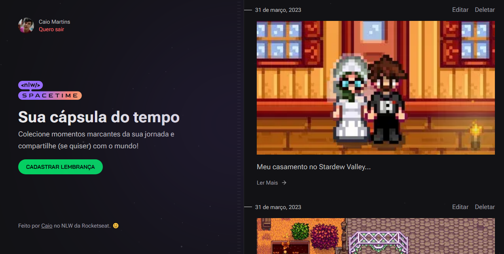
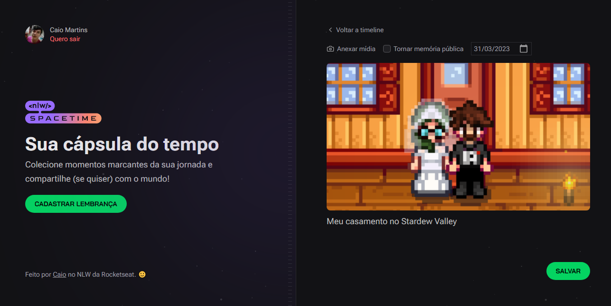
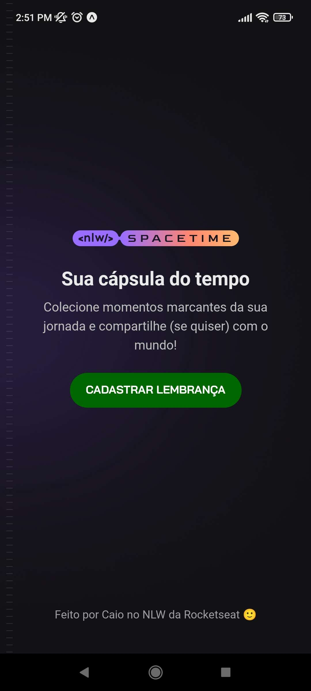
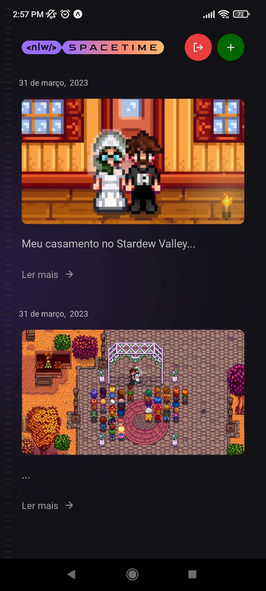

## 📌 Sobre

**NLW Spacetime** é um projeto da rocketseat, que busca um aprendizado de várias tecnologias atuais, onde são 5 aulas em uma semana.

Após concluir as aulas do projeto, adicionei várias funcionalidades extras para aprimorá-lo.

Algumas das melhorias incluíram a adição de mensagens de notificação (toast messages), a implementação da opção de exclusão de memórias, a capacidade de editar memórias existentes e a adição de uma visualização detalhada das memórias ao clicar em "Ler mais".

## 🚀 Tecnologias utilizadas

O projeto foi desenvolvido utilizando as seguintes tecnologias:

### 🖥 Web

- [Nextjs](https://nextjs.org/)
- [Tailwindcss](https://tailwindcss.com/)
- [Axios](https://axios-http.com/ptbr/docs/intro)
- [Typescript](https://www.typescriptlang.org/)

### 🛰️ Server

- [NodeJs](https://nodejs.org/en/docs)
- [Fastify](https://www.fastify.io/)
- [Prisma](https://www.prisma.io/)
- [Zod](https://zod.dev/)
- [Typescript](https://www.typescriptlang.org/)

### 📱 Mobile

- [React native](https://reactnative.dev/)
- [Expo](https://expo.dev/)
- [Axios](https://axios-http.com/ptbr/docs/intro)
- [Tailwindcss](https://tailwindcss.com/)
- [Typescript](https://www.typescriptlang.org/)

## ✏ Para iniciar o projeto basta utilizar os seguintes comandos

- Clonar o repositório

    <pre><code>git clone https://github.com/CaioMMendes/NLW-Spacetime</code></pre>

- Abrir a pasta no VsCode
- Adicionar um arquivo .env no servidor contendo DATABASE_URL, GITHUB_CLIENT_ID E GITHUB_CLIENT_SECRET do projeto mobile e do projeto web.
  
- Executar o servidor
    <pre><code>npm i</code></pre>
    <pre><code>npm run dev </code></pre>
- Abrir o web ou mobile e executar
    <pre><code>npm i</code></pre>
    <pre><code>npm run dev </code></pre>
